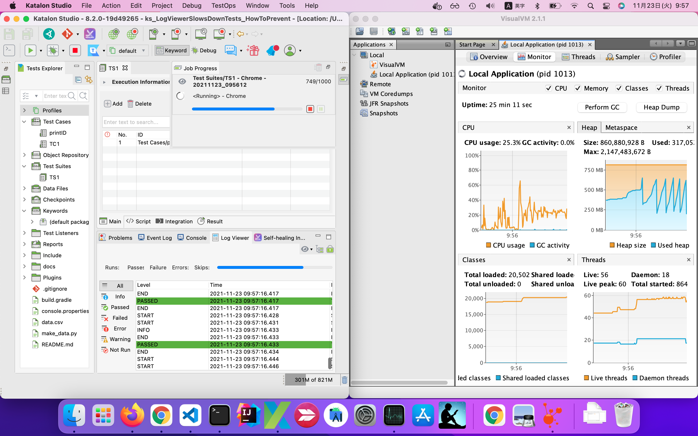
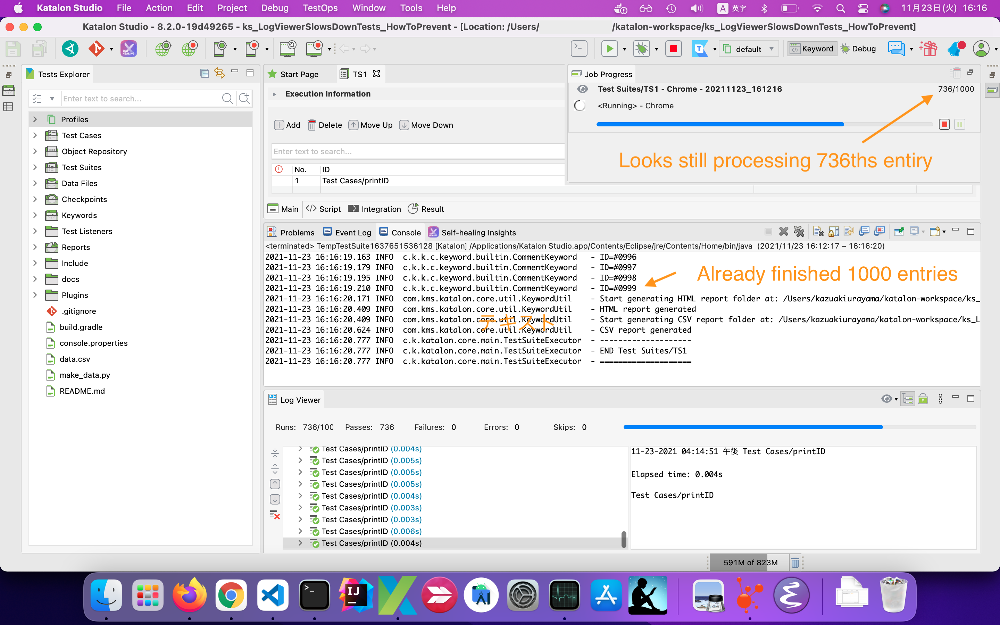
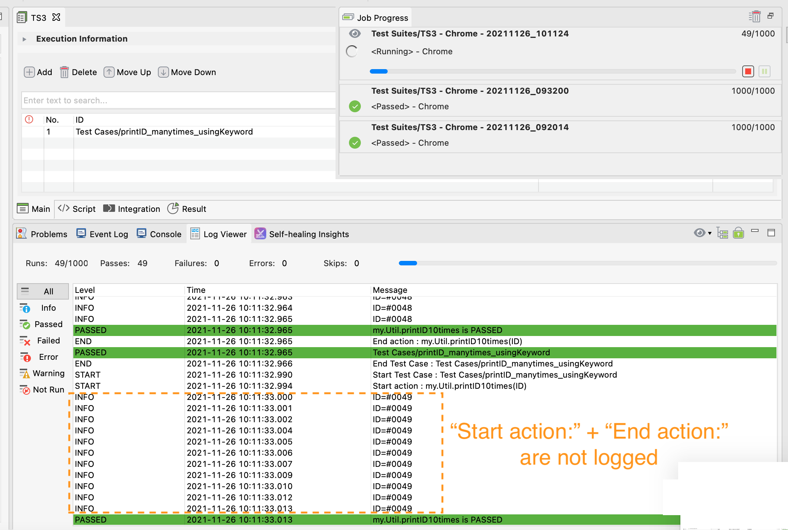

# Log Viewer slows down your tests. How to prevent it?


## Problem to solve

Katalon Studio's "Log Viewer" slows down your test execution significantly. Are you aware of this fact?

Maybe not. So I will report my analysis here. I can explain how to make it better.

## Measurement result

Let me go straight to the point. The following table shows the result I measured how long a Test Suite took to finish running. I used a single Test Suite while I applied several variation of the "Log Viewer" setups.

As the following table shows, *in the case 1, my test suite took 5 minutes 37 seconds to finish. But the same code finished in 25 seconds in the case 9*. This difference proves that the "Log Viewer" slows down your tests. How you set up Log Viewer --- it matters significantly to the speed of your tests.

| Case | log executed test steps | Widget is | Mode  | log level | scroll  | duration | duration graph |
| ---: | :------- | :-------- | :---- | :-------- | :------ | ------------: | :----------------------------------- |
| 1    | Enabled  | Attached | Tree  | -     | enabled | 5 minutes 37 seconds | `##################################` |
| 2    | Enabled  | Attached | Tree  | -     | locked | 3 m 25 s | `#####################` |
| 3    | Enabled  | Attached | Table | All   | enabled | 3 m  4 s | `##################` |
| 4    | Enabled  | Attached | Table | All   | locked  | 1 m 36 s | `#########` |
| 5    | Enabled  | Attached | Table | F+E+W | enabled | 56 s | `######` |
| 6    | Enabled  | Attached | Table | F+E+W | locked  | 1 m 10 s | `#######` |
| 7    | Enabled  | Detached | Tree  | -     | enabled | 5 m 35 s | `##################################` |
| 8    | Enabled  | Detached | Tree  | -     | locked  | 4 m 15 s | `##########################` |
| 9    | Enabled  | Closed   | -     | -     | -       | 25 s | `###` |
| X1   | Disabled | Attached | Tree  | -     | enabled | 3 m 53 s | `#######################` |
| X2   | Disabled | Attached | Tree  | -     | locked  | 3 m  2 s | `##################` |
| X3   | Disabled | Attached | Table | All   | enabled | 2 m 33 s | `###############` |
| X4   | Disabled | Attached | Table | All   | locked  | 1 m 41 s | `##########` |
| X5   | Disabled | Attached | Table | F+E+W | enabled | 2 m  9 s | `#############` |
| X6   | Disabled | Attached | Table | F+E+W | locked  | 1 m 59 s | `############` |
| X7   | Disabled | Detached | Tree  | -     | enabled | 5 m  3 s | `##############################` |
| X8   | Disabled | Detached | Tree  | -     | locked  | 4 m  3 s | `########################` |
| X9   | Disabled | Closed   | -     | -     | -       | 25 s | `###` |


## Code to run

I made a Test Suite, a Test Case, and a CSV file as a test fixture.

### Test Suite `TS1`

I made a Test Suite `TS1`, which applies "A. Execution from test suites" as described in the article ["Data-driven testing approach with Katalon Studio"](https://medium.com/katalon-studio/data-driven-testing-approach-with-katalon-studio-b835c9e491dd). 

`TS1` calls the Test Case `printID` for all rows in the `data.csv` file, which contains 1000 lines. `TS1` repeats calling the `printID` script 1000 times.


### Test Case `printID`

I made a Test Case [`Test Case/printID`](Scripts/printID/Script1637309731921.groovy), which is minimal:

```
import com.kms.katalon.core.webui.keyword.WebUiBuiltInKeywords as WebUI

WebUI.comment("ID=${ID}")
```

This `printID` declares a variable `ID` as:


The `ID` variable will be populated by `TS1` with data picked up from `data.csv` file.


### `data.csv` file

I made a CSV file: [data.csv](./data.csv). 

```
ID
#0000
#0001
#0002
#0003
#0004
...
#0998
#0999
```

This file contains 1000 lines. `TS1` reads this, iterate all lines, find the value of `ID` column, which is passed to the `printID` test case.

## How I measured the duration

When I say "the TS1 took 5 minutes 37 seconds", how did I record when it started and when it ended?

As soon as I clicked the run button  to start `TS1`, a "Job Progress" modal window will open.


In the "Job Progress" window, I found a figure, like `37/1000` which goes on incrementing. This means, the Test Suite `TS1` is repeating to call the Test Case `printID` for 1000 times as total, and it has finished 37 times.

I used a *Timer* app on my Android mobile phone to measure the duration. I started it as soon as I clicked the run button; wait for a while. When the "Job Progress" showed `1000/1000`, I stopped the timer. This is the way how I measured the duration of `TS1`.

## Log Viewer setup options

Here I will enumerate the options of Log Viewer setups.

### Log Viewer widget can be Attached/Detached/Closed

Usually a Log Viewer widget is attached in the Katalon Studio's window.


By a right-clicking the name tab, you can detach the Log Viewer widget from the Katalon Studio's window. The following image shows how it looks like.


Even if detached, the Log Viewer widget is still alive and in action.

You can even close the window of the detached Log Viewer widget.


Once Log Viewer widget has disappeared, Log Viewer is no longer there.

If you stop and restart Katalon Studio GUI, the Log Viewer widget will revive.

### Mode of Log Viewer

Log Viewer has 2 formats. Namely, "Log view" and "Tree view". You can choose by toggling the button.


#### Log view


#### Tree view


### Log type options

In the Log view, you can select which type of logs to be displayed: All, Info, Passed, Failed, Error, Warning, Not Run


### Step Execution Log

If you select "All" in the Log view and run a test, you will see quite a lot of "START" and "END" logs are printed.


If you deselect "All", then no START and END logs will be visible.

### Log executed test steps - Enabled/Disabled

The START and END logs are also called *"step execution logs"*.

In the "Project Settings > Execution" dialog, you will find an option: "Log executed test steps":


If you have a Katalon Studio Enterprise license, you can disable logging START and END.

If you do not have the Enterprise license, you will be advised to purchase it.


### Scroll Lock

Log Viewer widget has a toggle button with "Lock"-like icon, which is labeled "Scroll Lock".


If you toggle it ON, the Log Viewer stops automatic scrolling. Even when a test emits thousands of logs, the "Log view" will show only 10 or 20 lines at the top only and stay quiet. But the "tree view" will continue trembling even if it is "Scroll Locked" while a test is running.

## How is "Log Viewer" setup initially

When you newly installed Katalon Studio or you have upgrade it to a newer version, the Log Viewer will be automatically re-configured as follows:

- Log Viewer widget is attached into the Katalon Studio window.
- Log Viewer shows Tree view, rather than Log view, initially
- In the Log view, "All" level is selected initially
- The "Scroll Lock" is off initially

I believe that most of the Katalon Studio users are using it with this Log Viewer setups unchanged. This means, you are running your tests as the slowest "case1".

## How much memory is used? how much CPU is occupied?

When I execute the Test Suite `TS1`, how much memory is used? how much CPU is occupied? I wanted to examine this.

I used a profiling tool [VisualVM](https://visualvm.github.io/) and had a look.

The conditions are:

- Machine: MacBook Air (Retina, 13-inch, 2018)
- Processor: 1.6 GHz Intel Core i5
- Physical memory: 16 GB
- OS: macOS Monterey v12.0.1
- Katalon Studio: v8.2.0
- JVM arguments in the `katalon.ini` :
  - XX:+UseG1GC
  - XX:+UseStringDeduplication
  - Xms256m
  - Dfile.encoding=utf-8
  - Xmx2048m
- VisualVM versioin2.1.1
- run the `TS1` with "case 1" settings of Log Viewer

 

Let me enumerate what I observed.

1. The Heap size stayed under 821 MB.
2. The size of used heap moved in the range of 240 MB - 700 MB. The Garbage Collection mechanism was working properly. The heap used by Katalon Studio's Log Viewer is well managed.
3. The CPU usage went in the rage of 15 % - 30 %. It seemed it would not blow up to 100 %.

Even if the `TS1` repeated calling the `printID` for 5000 times, 16000 times or more, I suppose CPU and memory usage by `TS1` will be the same. I think it would be fair to say that Log Viewer is not guilty for memory usage.

I tried the case 9 (Log Viewer is detached & closed) with VisualVM. I saw that CPU usage went in the range of 15 % - 30 %, but the test finished far quicker. 


## Conclusion

If your test is running quick enough now and if you are happy with it, forget me! You don't need my advise.

In order to make your tests run faster, I would advise you to follow this:

1. You should not use the Tree view of the Log Viewer; you should prefer the Log view.

2. In the Log view, you should never select the "All" level to print, as it emits bulky "step execution logs".

3. In the Log view, You should select levels you need: e.g, "Failure" + "Error" + "Warning". This will reduce the volume of logs to be printed. You can add "Info" if you like.

4. If you have a Enterprise license, you should set the "Log executed test steps" disabled.

5. You could detach the Log Viewer widget and close it. Then your tests will run at the highest speed.

## Appendix:

### Time lag

I will give you one more surprise to you.

Test Suite `TS1` actually finishes processing data far earlier before the Log Viewer flushes all logs.

I have done an experiment. In Katalon Studio v8.2.0, I opened both the Console widget and the Log Viewer widget. The Log Viewer is configured to show Tree view.



I measured how long the `TS1` takes to finish. The result was interesting one:

| Widget     | duration | duration graph |
| :--------- | :----------- | :-------------------------- |
| In Console | 4 min 5 sec  | `#########################` |
| In Log Viewer |6 min 10 sec | `#####################################` |

After 4 minutes 5 seconds, `TS1` finished processing all data entries. At that time, the Job Progress monitor showed `736/1000`. It was imply wrong information.

Obviously, the Log Viewer is too slow to display the raging stream of logs.


### "Logging executed test steps" matters

The Test Case `printID`, which is called by the Test Suite `TS1`, is minimal. It has only one line:
```
WebUI.comment("ID=${ID}")
```
When called, `printID` emits just a few *step execution logs* like,


I added another Test Case [`printID_manytimes`](Scripts/printID_manytimes/Script1637826095527.groovy), which is called by another Test Suite `TS2`. The test case has a loop of calling a keyword 10 times.

```
for (int i in 0..10) {
	WebUI.comment("ID=${ID}")
}
```
With this loop, this test case will emit 10 times more of START + END logs into the Log Viewer.

I examined 3 cases where
- caseY1 : Execute TS2, with "Log executed test steps" option Enabled, with the Log Viewer is attached 
- caseY2 : Execute TS2, with "Log executed test steps" option Disabled, with the Log Viewer is attached
- caseY3 : Execute TS2, with "Log executed test steps" option Disabled, with the Log Viewer is closed

The following is the result.

| case |  Suite| Step Execution Log |Log Viewer|Mode|duration| duration graph |
| :--- | :-- | :------- | :------- |:---- | :------------- | :------- |
| Y1 | TS2 | Enabled  | Attached | Tree | 25 min 17 secs | #########+#########+#########+#########+#########+#########+#########+#########+#########+#########1#########+#########+#########+#########+#########+#########+#########+#########+#########+#########2#########+#########+#########+#########+#########+#########+#########+#########+#########+#########3#########+#########+#########+#########+#########+#########+#########+#########+#########+#########4#########+#########+#########+#########+#########+#########+#########+#########+#########+#########5#########+#########+#########+#########+#########+#########+#########+#########+#########+#########6#########+#########+#########+#########+#########+#########+#########+#########+#########+#########7#########+#########+#########+#########+#########+#########+#########+#########+#########+#########8#########+#########+#########+#########+#########+#########+#########+#########+#########+#########9#########+#########+#########+#########+#########+#########+#########+#########+#########+#########0#########+#########+#########+#########+#########+#########+#########+#########+#########+#########1#########+#########+#########+#########+#########+#########+#########+#########+#########+#########2#########+#########+#########+#########+#########+#########+#########+#########+#########+#########3#########+#########+#########+#########+#########+#########+#########+#########+#########+#########4#########+#########+#########+#########+#########+#########+#########+#########+#########+#########5##|
| Y2 | TS2 | Disabled | Attached | Tree |  6 min 11 secs | #########+#########+#########+#######|
| Y3 | TS2 | Disabled | Closed   | -    |  0 min 43 secs | #### |

Impressive, isn't it?

It is ridiculous to wait such a long time for the Log Viewer to display the superfluous "START" & "END" logs.

Many Katalon Studio users are running long-haul tests (hours, days ...). Now I will tell you; your test is the same as the case Y1. Now you know how to improve.

### Test with Custom Keyword runs faster

As you see in the above section, the Test Suite `T2` in the case Y1 took over 25 minutes whereas the same `T2` in the case Y2 took only 6 minutes. Why such a difference? It depends on if the "Log executed test steps" option is Enabled or Disabled. If you have an Enterprise license, you can disable the option and enjoy a faster test run. But if you don't, you can not disable it. *Is there any other way to make you test run faster in the Free version?*.

Yes, there is a way. You can rewrite your Test Case script so that you make a combination of a Custom Keyword and a short Test Case that just calls the Custom Keyword. Your Test Case will delegate the Custom Keyword to perform concrete test processing.

Let me tell you what I examined.

I made a Custom Keyword class [`Keywords/my/Util.groovvy`](Keywords/my/Util.groovy):

```
package my

import com.kms.katalon.core.webui.keyword.WebUiBuiltInKeywords as WebUI

import com.kms.katalon.core.annotation.Keyword

public class Util {

	@Keyword
	static void printID10times(String id) {
		for (int i in 0..10) {
			WebUI.comment("ID=${id}")
		}
	}
}
```

Please note that the Keyword `printID10times()` does just the same as what the Test Case `printID_manytimes` does in the `TS2`.

I made a new Test Case [`Test Cases/printID_manytimes_usingKeyword`](Scripts/printID_manytimes_usingKeyword/Script1637885416925.groovy). This just invokes the Custom Keyword passing parameter values.

```
CustomKeywords.'my.Util.printID10times'(ID)
```

I made a new Test Suite `TS3` which calls the Test Case `printID_manytimes_usingKeyword` for 1000 times while passing data from a CSV file.

The following table shows the measurement result. Please find the case **Y4** result.

| case |  Suite| Step Execution Log |Log Viewer|Mode|duration| duration graph |
| :--- | :-- | :------- | :------- |:---- | :------------- | :------- |
| Y1 | TS2 | Enabled  | Attached | Tree | 25 min 17 secs | |
| Y2 | TS2 | Disabled | Attached | Tree |  6 min 11 secs | #########+#########+#########+####### |
| Y3 | TS2 | Disabled | Closed   | -    |  0 min 43 secs | #### |
| Y4 | **TS3** | **Enabled**  | Attached | Tree |  9 min 30 secs | #########+#########+#########+#########+#########+####### |

In the case Y4, `TS3` ran in 9 minutes. It is not as fast as the case Y2 (`TS2` in 6 minutes), but is much better than the case Y1 (`TS2` in 25 minutes).

Why the case Y4 ran faster than the case Y1?

It is because that *Katalon Studio does not log executed test steps within a Custom Keyword*. If you look at the Log view with "All" level selected while you ran `TS3`, you will see no verbose `Start action :` and `End action :` logs appearing. This makes the case `Y4` light-weighted.



 The Test Suite `TS3` will run the same both in the Enterprise version and the Free version.
