# Log Viewer's "Tree mode" slows down your tests. How to prevent it?


## Problem to solve

Katalon Studio's "Log Viewer" slows down your test execution siginifantly. Are you aware of this fact? Maybe not. So I will explain the result of my analysis here. Also I will explain how to make it better.

## Measurement result

Let me go straight to the point. The following table shows the result I measured how long a Test Suite took to finish running. I used just the same test code, but with several variation of the "Log Viewer" setups.

As the following table shows, my test suite took 5 minutes 37 seconds to finish in the case 1. But the same code finished in 25 seconds in the case 9. This difference proves that the "Log Viewer" slows down your tests. How how you set up Log Viewer --- it matters significantly to the speed of your tests.

| case | Widget is | Mode  | log level | scroll  | duration | duration graph |
| ---: | :-------- | :---- | :---- | ------: | :------------ | :----------------------------------- |
| 1    | Attached | Tree  | -     | enabled | 5 minutes 37 seconds | `##################################` |
| 2    | Attached | Tree  | -     | locked | 3 min 25 secs | `#####################` |
| 3    | Attached | Table | All   | enabled | 3 min  4 secs | `##################` |
| 4    | Attached | Table | All   | locked  | 1 min 36 secs | `#########` |
| 5    | Attached | Table | F+E+W | enabled | 56 secs | `######` |
| 6    | Attached | Table | F+E+W | locked  | 1 min 10 secs | `#######` |
| 7    | Detached | Tree  | -     | enabled | 5 min 35 secs | `##################################` |
| 8    | Detached | Tree  | -     | locked  | 4 min 15 secs | `##########################` |
| 9    | Closed   | Tree  | -     | -       | 25 secs | `###` |


## Code to run

I made a Test Suite, a Test Case, and a CSV file as a test fixture.

### Test Suite `TS1`

I made a Test Suite `TS1`, which applies "A. Execution from test suites" as described in the article ["Data-driven testing approach with Katalon Studio"](https://medium.com/katalon-studio/data-driven-testing-approach-with-katalon-studio-b835c9e491dd). 

`TS1` calls the Test Case `printID` for all rows in the `data.csv` file, which contains 1000 lines. So it will repeat calling the `printID` 1000 times.

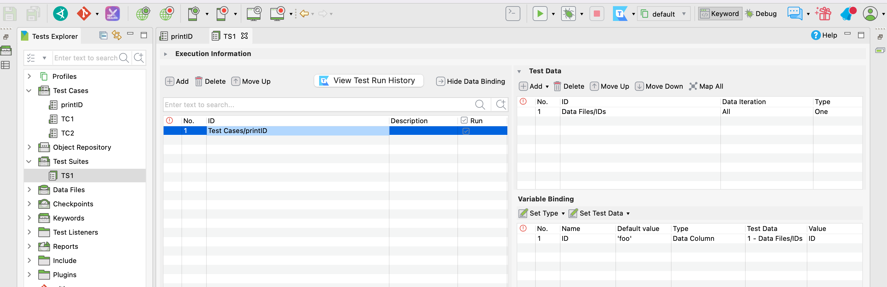

### Test Case `printID`

I made a Test Case [`Test Case/printID`](Scripts/printID/Script1637309731921.groovy), which is minimal:

```
import com.kms.katalon.core.webui.keyword.WebUiBuiltInKeywords as WebUI

WebUI.comment("ID=${ID}")
```

This `printID` declares a variable `ID` as:
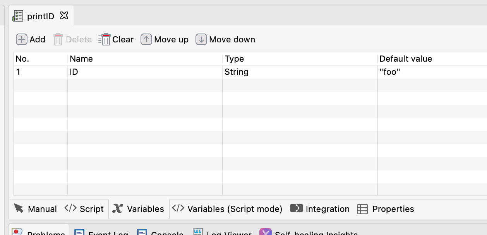, which would be populated by `TS1` with data from `data.csv` file as follows.


### `data.csv` file

I made a CSV file. It contains 1000 lines. My test reads this, iterate all rows, find the value of `ID` variable which is passed to test case.
[data.csv](./data.csv)

```
ID
#0000
#0001
#0002
#0003
#0004
...
#0998
#0999
```

## How I measured the duration

When I say "the TS1 took 5 minutes 37 seconds", how did I measure when it started and when it ended?

As soon as I start the Test Suite `TS1` by clicking the run button , "Job Progress" modal window will open.

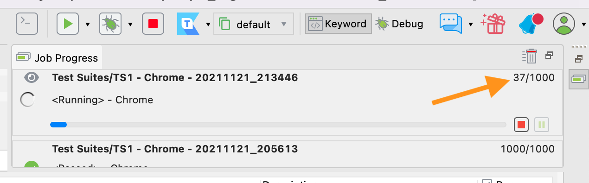

In the "Job Progress" window, I find a moving figure, like `37/1000`. This means, TS1 is going to repeat calling `PrintID` for 1000 times, and it has finished 37 times.

I used a *Timer* app on my Android mobile phone to measure the duration. I started the stop watch as soon as I clicked the run button, and wait a while. When the "Job Progress" showed `1000/1000`, I stopped the watch. This is the way how I measured the duration of the `TS1`.

## Log Viewer setup options

Here I will enumerate the options of Log Viewer setups.

### Log Viewer widget can be Attached/Detached/Closed

Usually a Log Viewer widget is attached in the Katalon Studio's window.

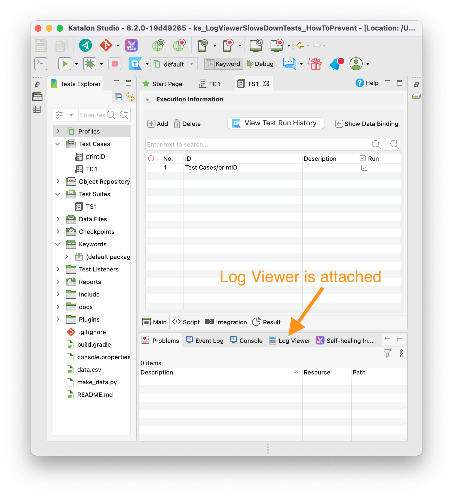

By a right-clicking the name tab, you can detach the Log Viewer widget from the Katalon Studio's window. The following image shows how it looks like. 

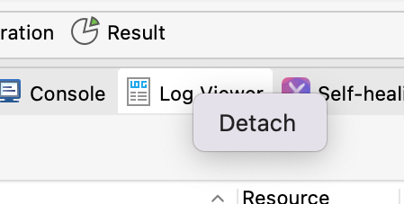

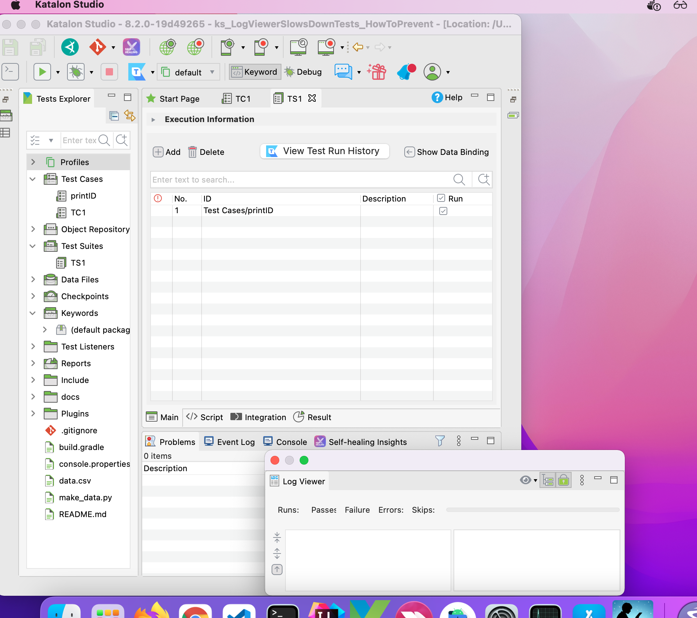

Even if detached, the Log Viewer widget is still alive and in action.

You can even close the window of the detached Log Viewer widget. 

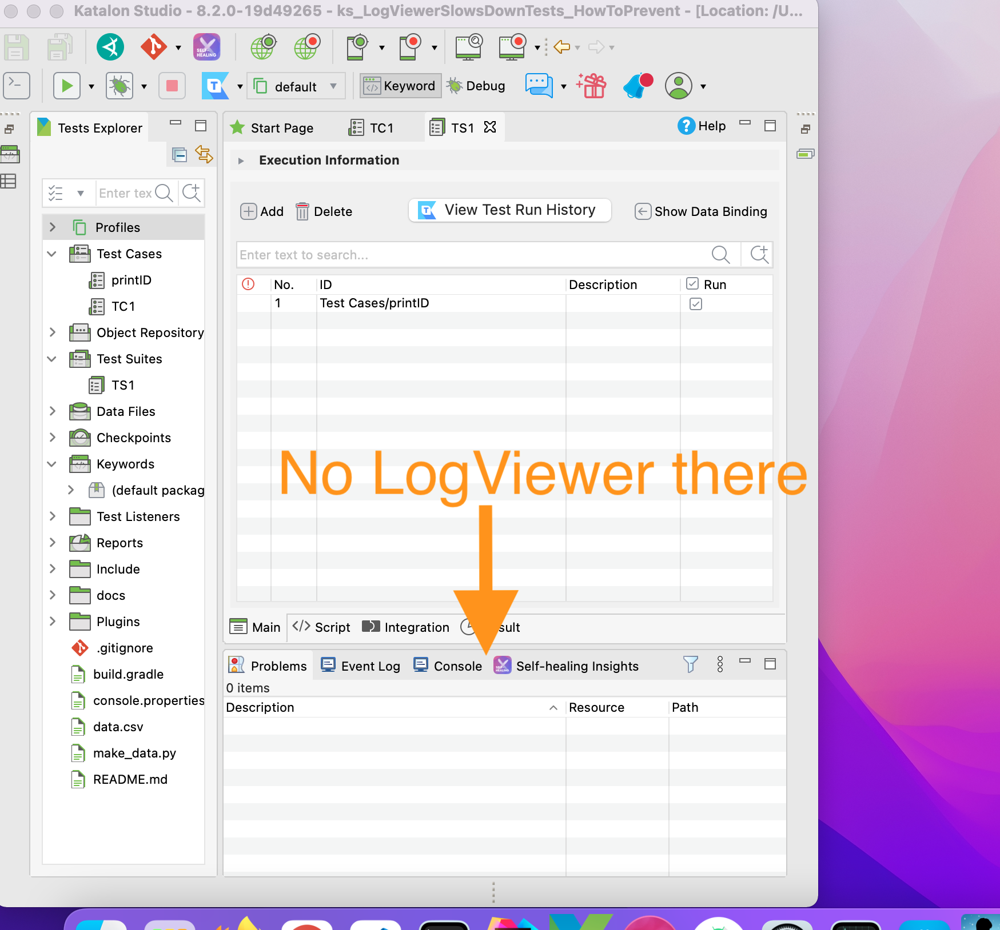

Then Log Viewer has disappeared. It is not in action any longer.

If you stop and restart Katalon Studio GUI, the Log Viewer widget will revive.

### Mode of Log Viewer

There are 2 format in the Log Viewer. Namely, "Log view" and "Tree view". You can choose by toggling the button 

#### Log view

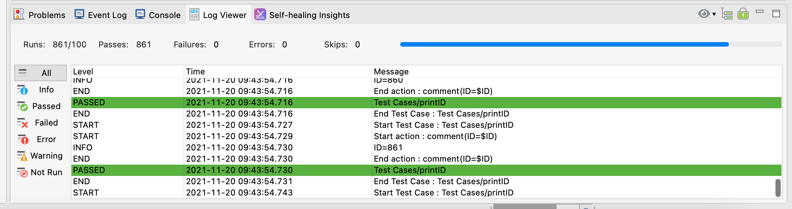


#### Tree view

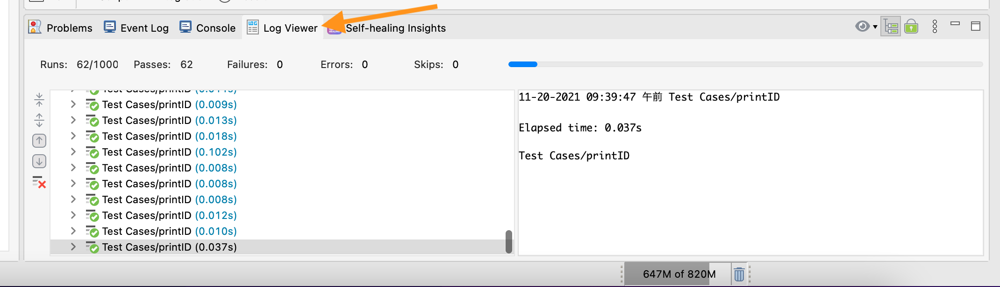

### Log type options

In the Log view, you can select which type of logs to be displayed: All, Info, Passed, Failed, Error, Warning, Not Run

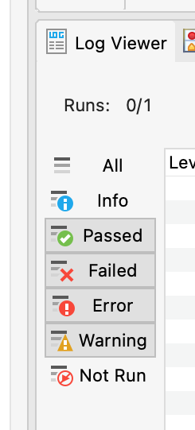

#### Step Execution Log

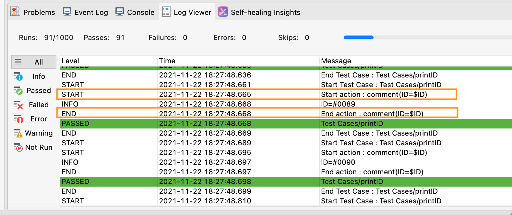


### Scroll Lock

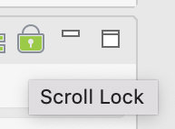

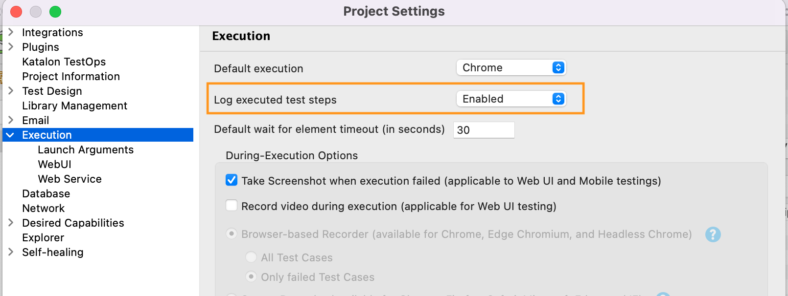

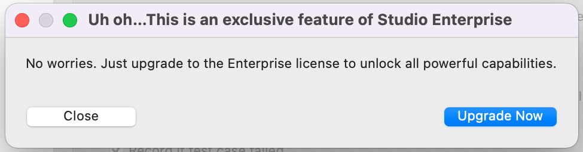

## How Log Viewer is setup as default

...

## Conclusion

Based on the investigation, to let your tests run faster, I would recommend to you as follows.

1. You should not use the Tree mode of the Log Viewer; you should prefer the Table mode.
2. In the Table mode, you should never select "All" to print, as it emits "step execution logs" which is too volumy.
3. In the Table mode, You shoud select "Failure" + "Error" + "Warning" levels to minimize the volume of logs printed. You could add "Info" if you like.
3. You could detach the Log Viewer widget and entirely close it. Then your tests will run in its maximum speed.

